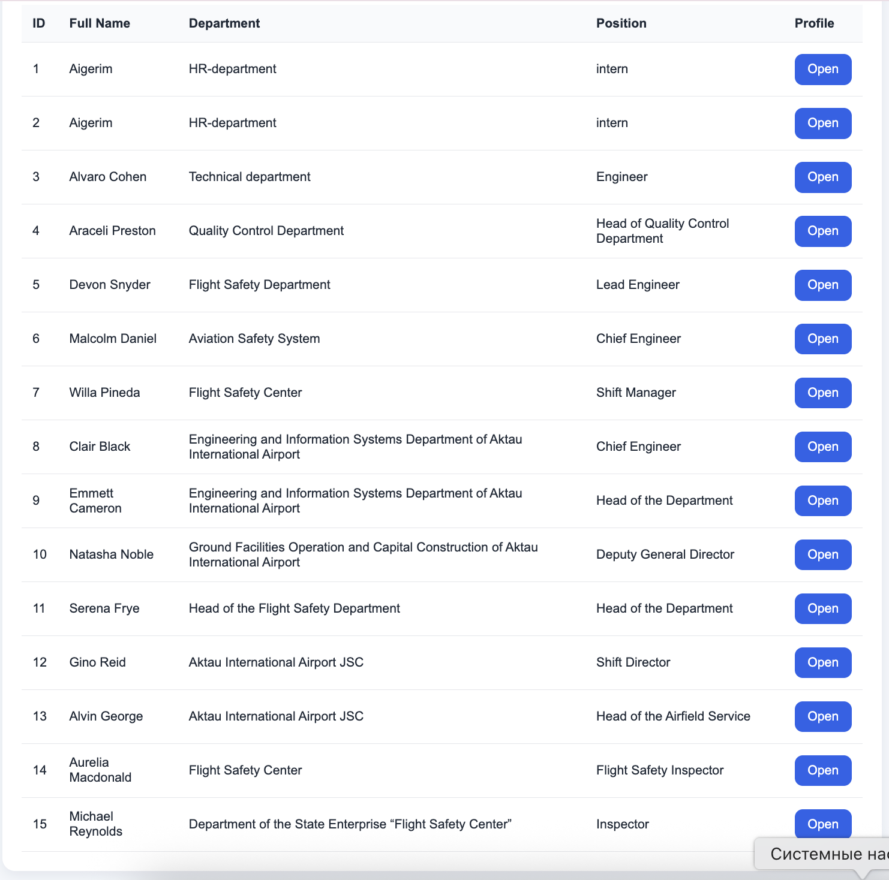
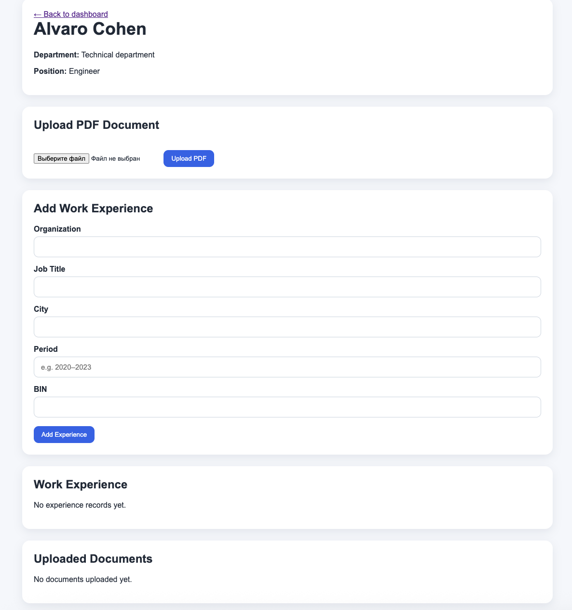

# HR Automation Portal

## 📌 Project Description
HR Automation Portal is a web-based system developed during internship at Aviation Administration of Kazakhstan.

The system is designed to automate HR processes, including employee data management, work experience tracking, and document processing.

## 🚀 Features

- Employee management (create, edit, delete)
- Work experience tracking
- PDF document upload
- Automatic text extraction from PDF
- Search and filtering system
- User-friendly dashboard and profile pages

## 🏗 System Architecture

The system follows a client-server architecture:

- Frontend: HTML + Jinja2 templates
- Backend: FastAPI (Python)
- Database: SQLite
- PDF Processing: pdfplumber

## 🗄 Database Structure

The system includes three main entities:

- Employee
- WorkExperience
- Document

Each employee can have multiple work experience records and documents.

## 🛠 Technologies Used

- Python
- FastAPI
- SQLAlchemy
- SQLite
- Jinja2
- pdfplumber

## ⚙ How to Run

1. Install dependencies:

pip install fastapi uvicorn sqlalchemy jinja2 pdfplumber python-multipart 

2. Run server:

uvicorn app.main:app --reload

3. Open in browser:

http://127.0.0.1:8000/dashboard

## Project Goals

- Automate HR processes
- Reduce manual data entry
- Improve document processing efficiency
- Provide structured employee data storage

## 📈 Future Improvements
- AI-based CV parsing
- Authentication system
- Cloud deployment
- Advanced analytics

## 👩‍💻 Author

Aigerim Koszhanova
Astana IT University

## 📷 Screenshots

### Dashboard

### Employee Profile
